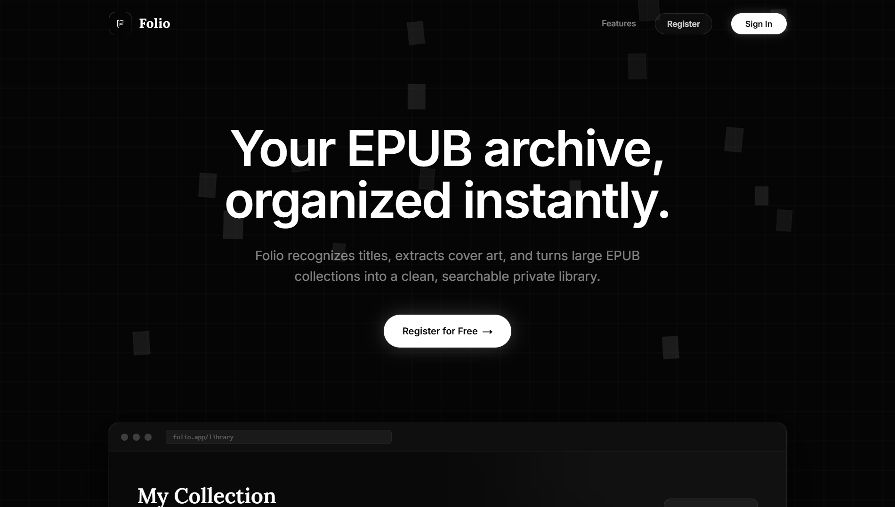
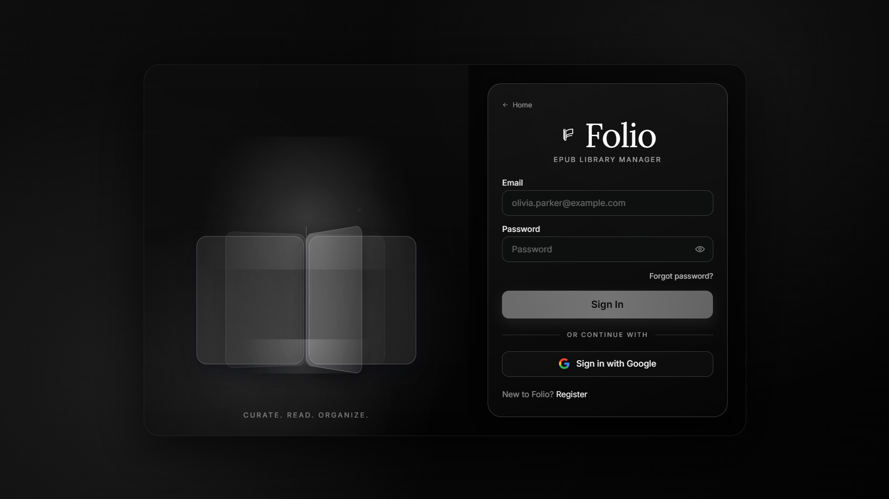
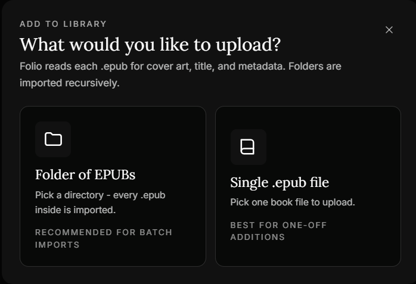
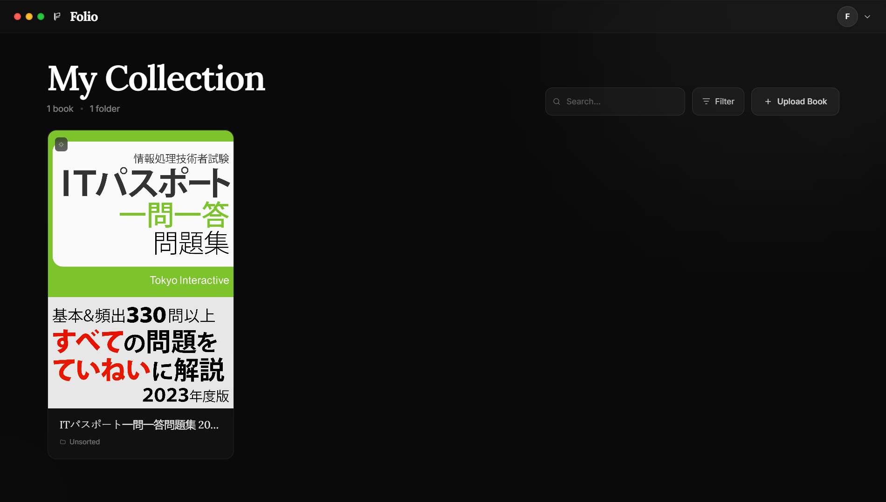

# Folio

<p align="center">
  
</p>

<p align="center">
  <strong>Private EPUB library management for teams and studios.</strong>
</p>

<p align="center">
  Invite-only access • EPUB ingestion • Metadata extraction • AI-assisted translation • Role-based dashboards
</p>

<p align="center">
  
  
  
  
</p>

---

## Overview

Folio is an internal EPUB library manager built for private team and studio workflows.

It provides secure invite-only access for readers and administrators, enabling EPUB upload, metadata extraction, cover parsing, AI-assisted translation, and clean role-based library management.

---

## Screenshots

### Landing Experience

<p align="center">
  
</p>

### Authentication Experience

<p align="center">
  
</p>

### EPUB Upload Flow

<p align="center">
  
</p>

### Reader Dashboard

<p align="center">
  
</p>

---

## Features

### Authentication & Access
- Invite-only onboarding
- Email/password authentication
- Google OAuth login
- Email verification
- Forgot-password recovery
- Role-based access control

### Reader Experience
- Personal EPUB uploads
- Folder-based batch imports
- EPUB metadata extraction
- Cover image extraction
- Library browsing
- Book detail inspection
- AI-assisted translation for non-English titles
- Delete owned books

### Administrator Tools
- Shared library visibility
- Delete any uploaded book
- Invite management
- Frontend activity audit review

### Infrastructure
- Row Level Security protection
- Hardened backend RPC access
- Storage usage reporting
- Production-ready deployment structure

---

## User Flow

### Reader
1. Register or sign in
2. Verify account
3. Enter dashboard
4. Upload EPUB files or folders
5. Browse personal collection
6. View extracted metadata and cover art
7. Translate titles when needed
8. Manage uploaded books

### Administrator
1. Sign in with admin access
2. Enter admin dashboard
3. Review shared library
4. Manage uploaded content
5. Send invites
6. Review operational activity logs

---

## Tech Stack

- **Frontend:** Next.js 16 App Router
- **Language:** TypeScript
- **Styling:** Tailwind CSS
- **Backend:** InsForge
- **Authentication:** InsForge Auth
- **Database:** InsForge Database
- **Storage:** InsForge Storage
- **AI Services:** InsForge AI
- **EPUB Processing:** JSZip

---

## Project Structure

### Frontend
- `src/components/auth-ui.tsx` — Authentication experience
- `src/app/dashboard/client.tsx` — Reader dashboard
- `src/app/admin/client.tsx` — Administrator dashboard
- `src/components/shared.tsx` — Shared UI components

### Backend Routes
- `src/app/api/auth/login/route.ts`
- `src/app/api/auth/register/route.ts`
- `src/app/api/auth/verify/route.ts`
- `src/app/api/auth/forgot-password/request/route.ts`
- `src/app/api/auth/forgot-password/verify/route.ts`
- `src/app/api/auth/forgot-password/reset/route.ts`
- `src/app/api/upload/route.ts`
- `src/app/api/books/route.ts`
- `src/app/api/storage-stats/route.ts`

---

## Setup

### Install Dependencies

```bash
npm install
```

### Environment Variables

Create `.env.local`

```env
NEXT_PUBLIC_INSFORGE_URL=https://your-app.region.insforge.app
NEXT_PUBLIC_INSFORGE_ANON_KEY=your-anon-key
INSFORGE_SERVICE_KEY=your-server-only-key
```

### Start Development

```bash
npm run dev
```

### Production Build

```bash
npm run build
```

---

## Deployment Notes

### Required
- `src/`
- `public/`
- `package.json`
- `package-lock.json`
- `next.config.ts`
- `postcss.config.mjs`
- `tsconfig.json`
- Production environment variables


---

## Security Notes

- `public.users` is protected with Row Level Security
- Sensitive backend RPCs are hardened
- Service credentials remain server-side only
- Frontend audit logging is local-only and not centralized

---

## Known Follow-Ups

- Replace frontend audit logs with backend audit infrastructure
- Expand admin observability
- Centralize operational event logging
- Simplify legacy schema fields like `uploaded_by`

---

<p align="center">
  Built for private EPUB workflows.
</p>